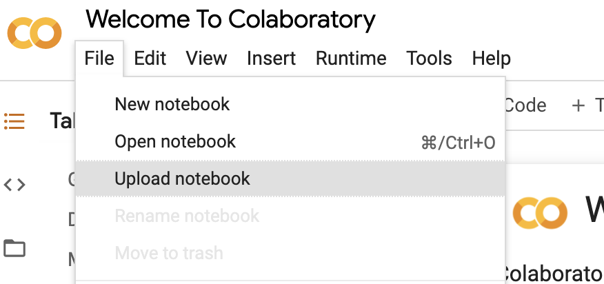
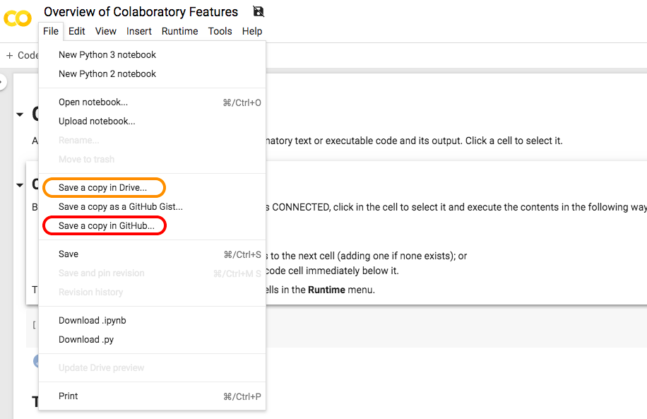

<!-- # Final-Year-Project-PCS23_19
Repository for Final Year Major Project 

# Deceptive Content Analysis: Google Colab Notebook Guide

Welcome to the **Google Colab Notebook Guide**! This guide will walk you through how to effectively use the `.ipynb` file in Google Colab. 

## Table of Contents
- [Introduction](#introduction)
- [Prerequisites](#prerequisites)
- [Getting Started](#getting-started)
- [Working with the Notebook](#working-with-the-notebook)
- [Saving and Sharing](#saving-and-sharing)
- [Additional Resources](#additional-resources)
- [Contributing](#contributing)
- [License](#license)

## Introduction
Google Colab is a cloud-based platform that allows you to create, edit, and run Jupyter notebooks using Python. This guide aims to provide you with a smooth experience using `.ipynb` files in Google Colab.

## Prerequisites
Before you begin, make sure you have the following:
- A **Google account**
- Access to **Google Colab** (you can access it at [colab.research.google.com](https://colab.research.google.com))

## Getting Started
1. Open Google Colab by visiting [colab.research.google.com](https://colab.research.google.com).
2. Sign in with your Google account if you haven't already.

## Working with the Notebook
1. Click on the **File** tab in the top-left corner.
2. Select **Upload notebook** to upload the `.ipynb` file from your local machine.
3. Once uploaded, click on the notebook's filename to open it.

   
   
4. You can now view and edit the notebook in Google Colab.

## Saving and Sharing
To save

 -->
 
 <h1 align="center">Deceptive Content Analysis: Accessing Google Colab Notebook Guide</h1>

  

Welcome to the <b>Google Colab Notebook Guide</b>! This guide will walk you through how to effectively use the <code>.ipynb</code> file in Google Colab.

## Table of Contents
- [Introduction](#introduction)
- [Prerequisites](#prerequisites)
- [Getting Started](#getting-started)
- [Working with the Notebook](#working-with-the-notebook)
- [Saving and Sharing](#saving-and-sharing)
- [Additional Resources](#additional-resources)
- [Contributing](#contributing)
- [License](#license)

## Introduction
Google Colab is a cloud-based platform that allows you to create, edit, and run Jupyter notebooks using Python. This guide aims to provide you with a smooth experience using <code>.ipynb</code> files in Google Colab.

## Prerequisites
Before you begin, make sure you have the following:
- A **Google account**
- Access to **Google Colab** (you can access it at [colab.research.google.com](https://colab.research.google.com))

## Getting Started
1. Open Google Colab by visiting [colab.research.google.com](https://colab.research.google.com).
2. Sign in with your Google account if you haven't already.

## Working with the Notebook
1. Click on the **File** tab in the top-left corner.
2. Select **Upload notebook** to upload the <code>.ipynb</code> file from your local machine.
3. Once uploaded, click on the notebook's filename to open it.

   
   
4. You can now view and edit the notebook in Google Colab.

## Saving and Sharing
To save and share your work:
1. Click on the **File** tab in the top-left corner.
2. Select **Save** to save the changes made to the notebook.

   
   
3. To share the notebook, click on the **Share** button in the top-right corner.
4. Configure the sharing settings as desired (e.g., allow others to edit or view-only access).
5. Copy the sharing link or send invitations to collaborators via email.

## Additional Resources
- [Google Colab Documentation](https://colab.research.google.com/notebooks/intro.ipynb): Official documentation with detailed information on Google Colab.
- [Google Colab FAQ](https://research.google.com/colaboratory/faq.html): Frequently Asked Questions about Google Colab.

## Contributing
Contributions are welcome! If you find any issues or have suggestions for improvement, please feel free to submit a pull request.

## License
This project is licensed under the [MIT License](LICENSE).
